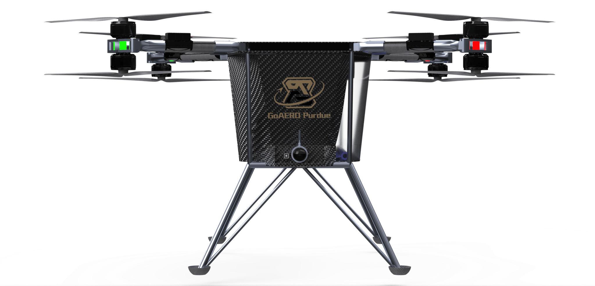

  

# About VFS
VFS Purdue is an AAE organization at Purdue University, composed of students from diverse disciplines with a shared interest in eVTOL aircraft design. Our mission is to participate in the development of an autonomy enabled emergency response aircraft to participate in the [GoAERO Competition](https://www.goaeroprize.com/). With the guidance of faculty and the support of Purdue University and collaborating with other organizations, we aim to excel in the three stages of the Competition while developing innovative eVTOL technologies